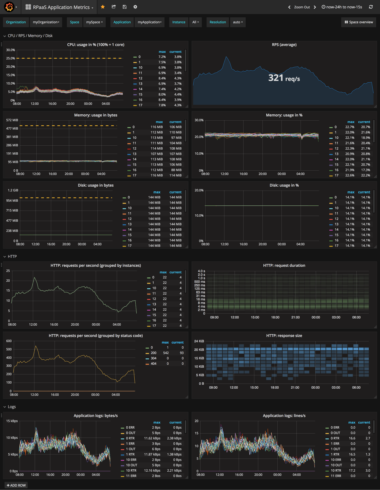
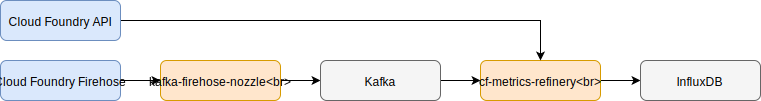

# cf-metrics-refinery


`cf-metrics-refinery` reads Cloud Foundry application metrics and logs, enriches them with the application metadata from the Cloud Foundry API and then forwards data to a sink.

Currently `cf-metrics-refinery` is capable of reading the application logs/metrics from Kafka and then writing the transformed/enriched results to InfluxDB.

Regarding the enriching part, the metedata is originally from Cloud Foundry API, then cached in the memory.
- fetch a fresh copy of all metadata: every 10m
- metadata is considered expired: after 3m since last used
- check for expired metadata: every 1m

`cf-metrics-refinery` was initally designed to read from Kafka because metadata enrichment can block, so Kafka can act as a buffer. The events generated by the Firehose are stored in Kafka topics. You can specify one or more Kafka topic to consume from. The events in Kafka are expected to be JSON-encoded using
the format defined in [`sonde-go`](https://github.com/cloudfoundry/sonde-go/tree/master/events) (the [kafka-firehose-nozzle](https://github.com/rakutentech/kafka-firehose-nozzle) is designed for this specific task).

<p align=center>
  
</p>

We plan to add support for additional input adapters (Firehose) and output adapters (Kafka/Syslog/...) in the future. Adding adapters requires simply implementing a `input.Reader` or `output.Writer`.

Currently `ContainerMetric`, `LogMessage` and `HttpStartStop` events are supported to produce the following InfluxDB events:

- each `HttpStartStop` event is stored as-is (tagged by instance index, HTTP status code and method)
- `LogMessage`s *originating from the application* (i.e. excluding from API, cell, router) is transformed to only include the length in bytes of the payload and stored (tagged by instance index and by FD, `STDOUT` or `STDERR`)
- each `ContainerMetric` event is stored as-is (tagged by instance index)

In addition to the tags above, each event also includes tags for org (name/guid), space (name/guid) and app (name/guid).

When flushing points to Influxdb,
- flush pending events: time-based(every 3s) and size-based(5000 points)
  Notice: currently if messages stop coming, the time-based flush won't happen.
- retries when flush fails: 3 times
- timeout of checking Influxdb is up: 30s

## Usage
Basic usage is,

```bash
$ cf-metrics-refinery [options]
```

The following are available options,

```bash
-h                 Display the manual for cf-metrics-refinery, including all
                   configuration environment variables.
-log-level LEVEL   Log level. Default level is INFO (DEBUG|INFO|ERROR)
```

## Configuration
`cf-metrics-refinery` is configured using environment variables. To get the list
of environment variables run `cf-metrics-refinery -h`
```
$ cf-metrics-refinery -h
This application is configured via the environment. The following environment
variables can be used:

KEY				TYPE				DEFAULT		REQUIRED	DESCRIPTION
CFMR_CF_API			String						true		URL of the Cloud Foundry API endpoint
CFMR_CF_USER			String						true		Username for the Cloud Foundry API
CFMR_CF_PASSWORD        	String          				true    	Password for the Cloud Foundry API
CFMR_CF_TIMEOUT			Duration			1m              		Timeout for Cloud Foundry API requests
CFMR_CF_SKIPSSLVALIDATION	True or False			false				Skip SSL certificate validation for Cloud Foundry API requests
CFMR_CF_RESULTSPERPAGE		Integer				50				Number of results per page to fetch from CF API
CFMR_CF_TOKEN			String								Token for Cloud Foundry API
CFMR_CF_CLIENTID		String								Client ID for Cloud Foundry API
CFMR_CF_CLIENTSECRET		String								Client secret for Cloud Foundry API
CFMR_INFLUXDB_USERNAME		String								Username to connect to InfluxDB
CFMR_INFLUXDB_PASSWORD		String								Password to connect to InfluxDB
CFMR_INFLUXDB_SKIPSSLVALIDATION	True or False			false				Skip SSL certificate validation when connecting to InfluxDB
CFMR_INFLUXDB_ADDR		String						true		URL of InfluxDB
CFMR_INFLUXDB_TIMEOUT		Duration			1m				Timeout for requests to InfluxDB
CFMR_INFLUXDB_DATABASE		String						true		Name of InfluxDB database to write to
CFMR_INFLUXDB_RETENTIONPOLICY	String								Name of the retention policy to use (instead of the default one)
CFMR_INFLUXDB_INFLUXPINGTIMEOUT	Duration			5s				Default timeout of checking Influxdb is up or not
CFMR_BATCHER_FLUSHINTERVAL	Duration			3s				How often to flush pending events
CFMR_BATCHER_FLUSHMESSAGES	Integer				5000				How many messages to flush together
CFMR_KAFKA_ZOOKEEPERS		String						true		Zookeeper nodes for offset storage
CFMR_KAFKA_TOPICS		Comma-separated list of String			true		Topics to read events from
CFMR_KAFKA_CONSUMERGROUP	String						true		Name of the Kafka consumer group
CFMR_KAFKA_PROCESSINGTIMEOUT	Duration			1m				Time to wait for all the offsets for a partition to be processed after stopping to consume from it
CFMR_KAFKA_OFFSETNEWEST		True or False			false				If true start from the newest message in Kafka in case the offset in zookeeper does not exist
CFMR_SERVER_PORT		String				8080				port of http server
CFMR_METADATAREFRESH		Duration			10m				How often to fetch a fresh copy of all metadata
CFMR_METADATAEXPIRE		Duration			3m				How long before metadata is considered expired
CFMR_METADATAEXPIRECHECK	Duration			1m				How often to check for expired metadata
CFMR_NEGATIVECACHEEXPIRE	Duration			20m				How long before negative cache is considered expired
CFMR_NEGATIVECACHEEXPIRECHECK	Duration			3m				How often to check for expired negative cache
```

## Install
`cf-metrics-refinery` can be deployed as Cloud Foundry application using the [go-buildpack](https://github.com/cloudfoundry/go-buildpack).

Since 

```
# push the app
cf push cf-metrics-refinery --no-start

# configure cf-metrics-refinery (alternatively, use a manifest)
cf set-env cf-metrics-refinery "CFMR_..." "..." 
...

# start
cf start cf-metrics-refinery
```

Here is a sample manifest for your reference:
```
$ cat manifest.sample.yml
applications:
- name: cf-metrics-refinery
  instances: 3
  routes:
  - route: cf-metrics-refinery.sample.com
  env:
    CFMR_CF_API: "https://api.sample.com" #your_cf_api
    CFMR_CF_USER: "your_cf_user"
    CFMR_CF_PASSWORD: "your_cf_password"
    CFMR_CF_TIMEOUT: "60000ms"
    CFMR_CF_SKIPSSLVALIDATION: "true"
    CFMR_INFLUXDB_USERNAME: "your_influxdb_username"
    CFMR_INFLUXDB_PASSWORD: "your_influxdb_password"
    CFMR_INFLUXDB_ADDR: "http://XX.XX.XX.XX:XX" #your_influxdb_address
    CFMR_INFLUXDB_TIMEOUT: "60000ms"
    CFMR_INFLUXDB_DATABASE: "your_influxdb_database"
    CFMR_KAFKA_ZOOKEEPERS: "XX.XX.XX.XX,XX.XX.XX.XX,XX.XX.XX.XX" #your_zookeeper_nodes
    CFMR_KAFKA_TOPICS: "topic1,topic2,topic3"
    CFMR_KAFKA_CONSUMERGROUP: "set_your_cg_name"
$
```

## Contributing

## Test
### Unit tests
go test ./...
### Crash tests
#### Influxdb
* The Influxdb is not available, when starting the app:
  Behaviors:
  * check Influxdb is up (timeout: 30s)
  * log errors
  * sleep (30s) to avoid flapping instances
  * exit
  * not lose data
* The Influxdb job is not available:
  Behaviors:
  * retry (`FlushRetries`: 3 times by default)
  * log errors
  * exit
  * not lose data
* The Influxdb VM is not available:
  Behaviors:
  * timeout (set by env variable `CFMR_INFLUXDB_TIMEOUT`)
  * retry (`FlushRetries`: 3 times by default)
  * log errors
  * exit
  * not lose data
#### ZK
* The ZK is not available, when starting the app:
  Behaviors:
  * [retry](https://github.com/Shopify/sarama/blob/master/config.go#L279)
  * log errors
  * exit
  * not lose data
* The ZK job is not available:
  Behaviors:
  * [retry](https://github.com/Shopify/sarama/blob/master/config.go#L279)
  * log errors
  * exit
  * not lose data
* The ZK VM is not available:
  Behaviors:
  * [timeout](https://github.com/Shopify/sarama/blob/master/config.go#L279)
  * [retry](https://github.com/Shopify/sarama/blob/master/config.go#L279)
  * log errors
  * exit
  * not lose data
#### Kafka
* The Kafka job is not available:
  Behaviors:
  * [retry](https://github.com/Shopify/sarama/blob/master/config.go#L279)
  * log errors
  * exit
  * not lose data
* The Kafka VM is not available:
  Behaviors:
  * [timeout](https://github.com/Shopify/sarama/blob/master/config.go#L279)
  * [retry](https://github.com/Shopify/sarama/blob/master/config.go#L279)
  * log errors
  * exit
  * not lose data
#### Cloud Controller API
* The CC API is not available, when starting the app:
  Behaviors:
  * log errors
  * exit
  * not lose data
* The CC or UAA or CCDB is not available, while the app is running normally:
  Behaviors:
  * timeout (set by env variable `CFMR_CF_TIMEOUT`)
  * retry (by default: 2)
  * fail to refresh metedata
  * log errors
  * use the cache to enrich
  * not lose data, but the data may not be 100% correct.

## Design
The idea is:
- have a input emit events containing sonde-go events.Envelope wrapped with additional fields
  - we would have two type of input, acknowledged (kafka) and non-acknowledged (firehose)
- pass each event to the Enricher
  - currently we cache the metadata from CF in memory. This means that we don't need an external store, but this also makes it hard to ensure that the cached metadata is consistent across parallel instances of `cf-metrics-refinery`.
  - Moreover, to decrease the meaningless calls of CC API, we implement the negative lookup cache layer which stores the app guids unable to be found from CC API in the memory.
- pass each enriched event to the output
  - we would have two type of output, acknowledged (kafka, influx) and non-acknowledged (none right now)
- ack handling is tricky:
  - if both input and output are of ack type, when the output acks one or more messages, we pass this info to the input
  - if input is ack and output is non-ack, each message is ack immediately to the input
  - if input is non-ack nothing is done
  - the additional fields in the event are used for ack purposes (correlation of output messages to input messages)
- expose stats http endpoint for debugging or even monitoring
- this component does not do aggregation: this is delegated to the drains targeted by the outputs
- sarama does not natively support zk-based consumer groups and offset tracking
  - here we use [consumergroup lib](github.com/wvanbergen/kafka/consumergroup) a library built on top of sarama

# Copyright
2018 Rakuten, Inc.

# License
[MIT](LICENSE)
